# ChatGPT Telegram Bot

This is a Telegram chat bot built using the ChatGPT (GPT-3.5 or GPT-4) language model from OpenAI.

Notable features:

-   Both one-on-one and group chats.
-   Direct questions, mentions, follow-ups.
-   Access external links (articles, code, data).
-   Shortcuts (custom AI commands).
-   Image generation.
-   On-the-fly configuration.

Read on for a detailed feature description or jump to [setup](#setup).

> **Free hosting**. I'd like to test PokiToki on larger groups. So if you have an active group with 500+ members and want to try the bot, I'll host it for you for free. You'll still have to sign up with OpenAI and pay its bills though.
>
> If you are interested, contact me on Telegram [@nalgeon](https://t.me/nalgeon)

## Personal chats

The bot acts as your personal assistant:

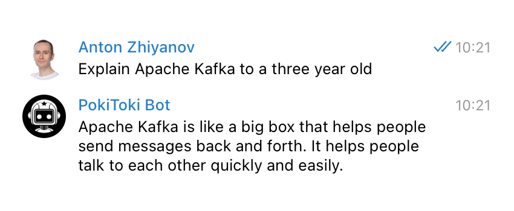

To allow other users to use the bot, list them in the `telegram.usernames` config property.

The bot has a terrible memory, so don't expect it to remember any chat context by default. You can, however, reply with a follow-up question (`Ctrl/Cmd + ↑`). Alternatively, use a plus sign to follow up:

<table>
    <tr>
        <td>
            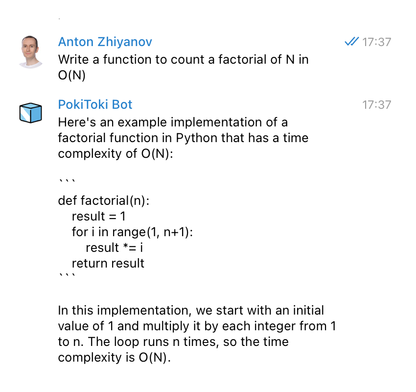
        </td>
        <td>
            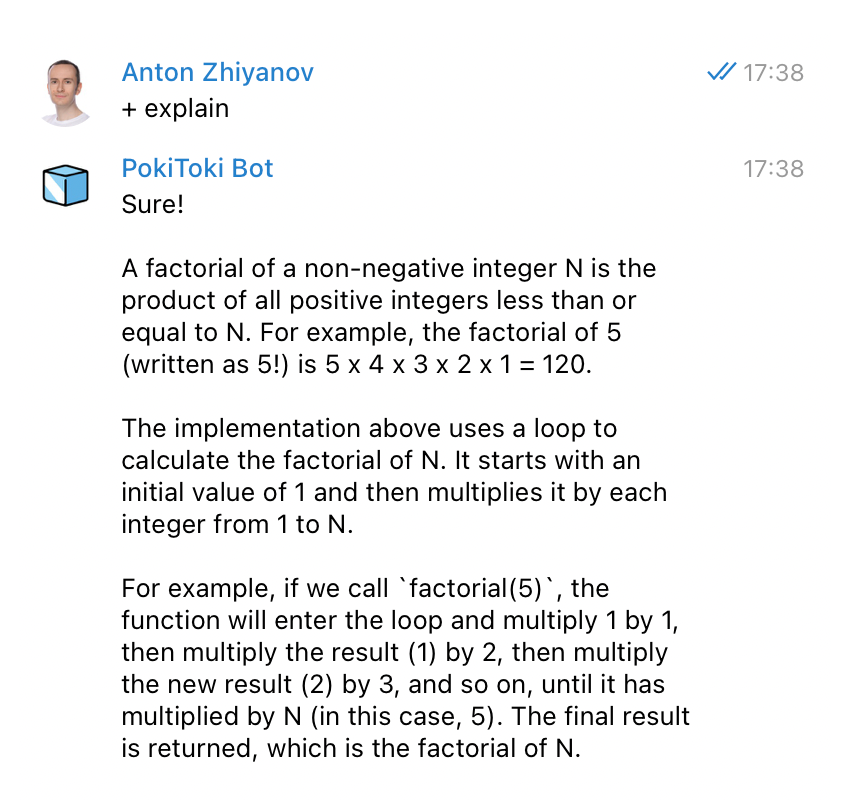
        </td>
    </tr>
</table>

Available commands:

-   `/retry` - retry answering the last question
-   `/help` - show help
-   `/version` - show bot info

To rephrase or add to the last question, simply edit it. The bot will then answer the updated question.

## Groups

To get an answer from the bot in a group, mention it in a reply to a question, or ask a question directly:

<table>
    <tr>
        <td>
            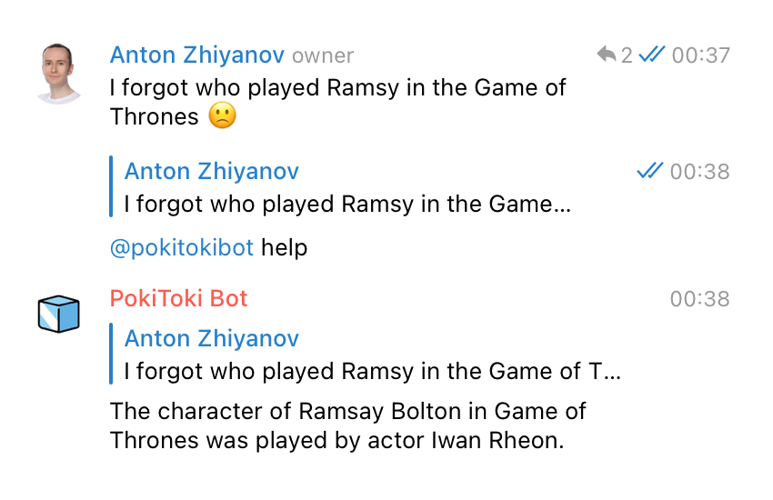
        </td>
        <td>
            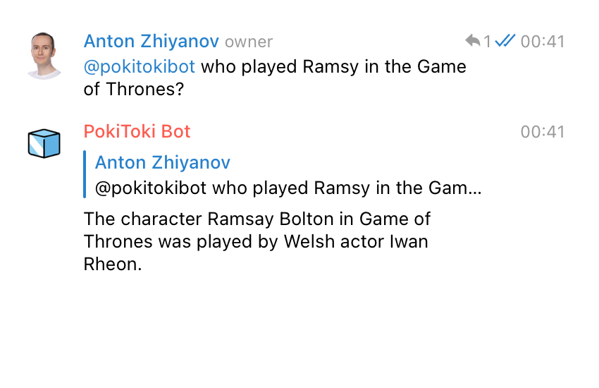
        </td>
    </tr>
</table>

To make the bot reply to group members, list the group id in the `telegram.chat_ids` config property. Otherwise, the bot will ignore questions from group members unless they are listed in the `telegram.usernames` config property.

If you don't know the group id, run the `/version` bot command in a group to find it:

```
Chat information:
- id: -1001405001234
- title: My Favorite Group
- type: supergroup
...
```

## External links

If you ask "vanilla" ChatGPT about external resources, it will either hallucinate or admit that it doesn't have access to remote content:

> Q: What is the content of https://sqlime.org/employees.sql? Make no assumptions.
>
> A: As an AI language model, I cannot access external URLs on the internet.

The bot solves the problem by fetching the remote content and feeding it to the model:

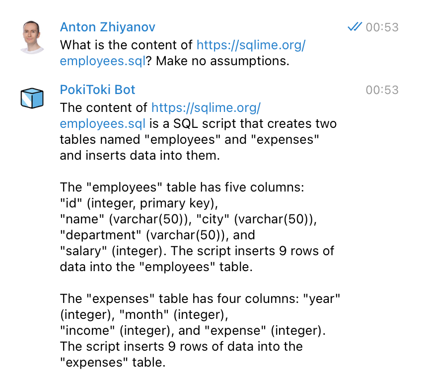

Currently only supports text content (articles, code, data), not PDFs, images or audio.

## Shortcuts

Use short commands to save time and ask the bot to do something specific with your questions. For example, ask it to proofread your writing with a `!proofread` command:

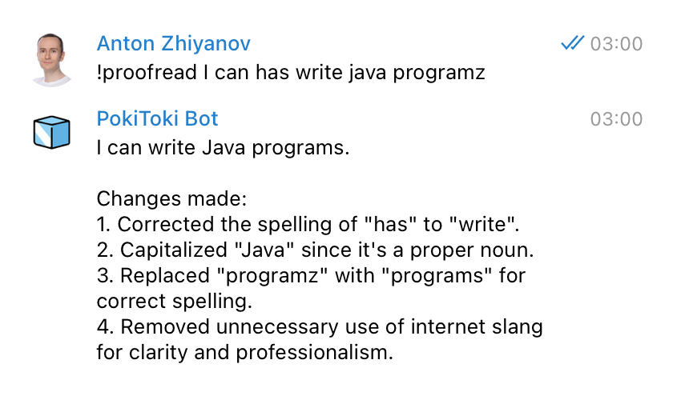

There are several built-in shortcuts:

-   `bugfix` fixes your code.
-   `proofread` fixes your writing.
-   `translate` translates your text into English.
-   `summarize` gives a two paragraph summary of a text.

You can add your own shortcuts. See `config.example.yml` for details.

## Image generation

Use the `/imagine` command to generate an image using the DALL-E 2 model from OpenAI:

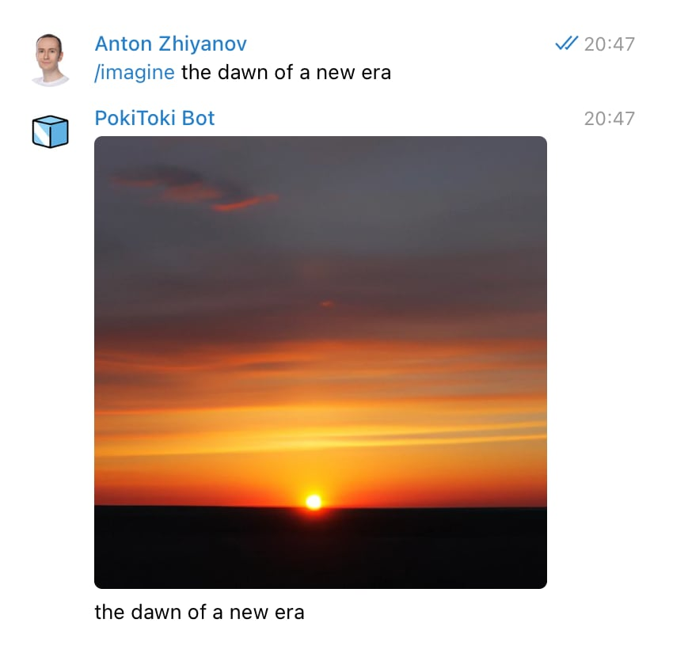

The default image size is 512×512 px. Other supported sizes are 256×256 and 1024×1024:

> /imagine a lazy cat on a sunny day 256x256
>
> /imagine a lazy cat on a sunny day 1024px

Image generation is quite pricey ($0.016-$0.020 per image). By default it's only enabled for users listed in `telegram.usernames`, not for group members. You can change this with the `imagine.enabled` config property.

## Other useful features

The convenience of working with a bot is made up of small details. Here are some situations where it can save you time and effort.

### Forwarding

Say you received a message from a colleague or read a post on a channel and want to ask a question. Simply forward the message to the bot and answer the clarifying question it asks:

<table>
    <tr>
        <td>
            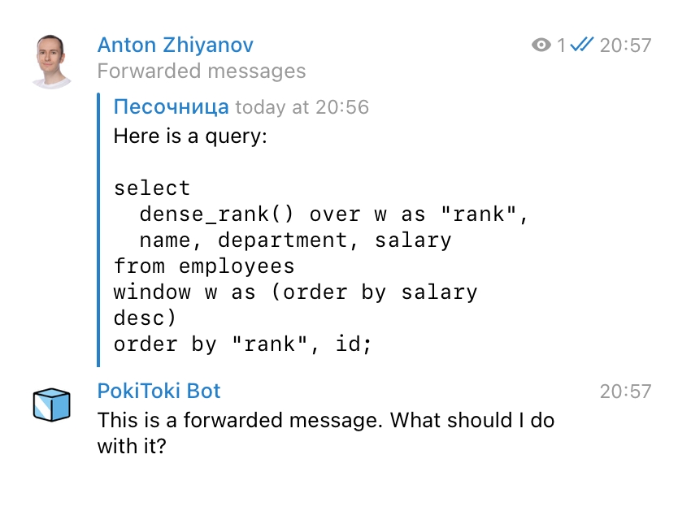
        </td>
        <td>
            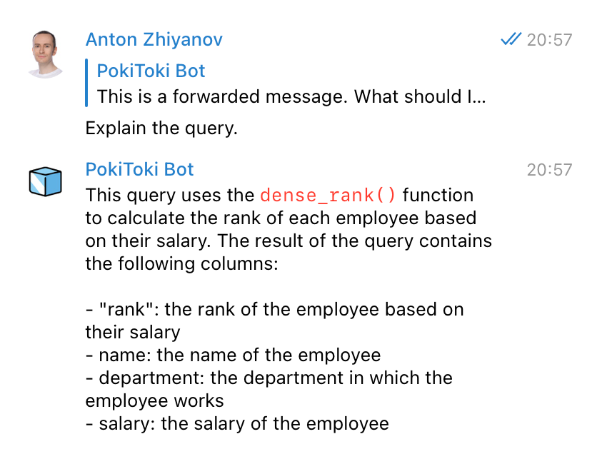
        </td>
    </tr>
</table>

### Reply with attachment

Sometimes the AI's reply exceeds the maximum message length set by Telegram. In this case, the bot will not fail or spam you with messages. Instead, it will send the answer as an attached markdown file:

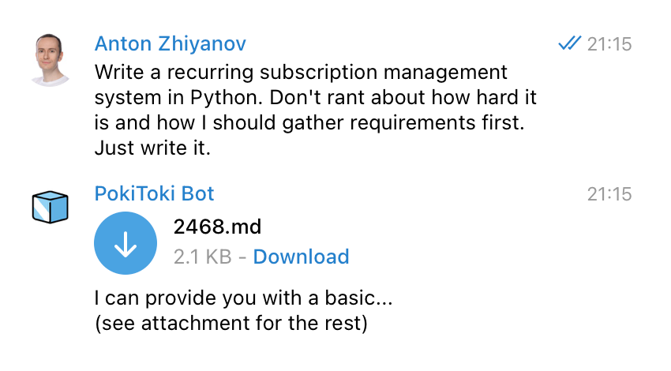

### Edited question

To rephrase or add to the last question, edit it (`↑` shortcut). The bot will notice this and respond to the clarified question.

## Bot information

Use the `/version` command to print detailed information about the current chat, bot, and AI model:

```
Chat information:
- id: -1001405001234
- title: My Favorite Group
- type: supergroup

Bot information:
- id: 5930739038
- name: @pokitokibot
- version: 129
- usernames: 6 users
- admins: 1 users
- chat IDs: []
- access to messages: True

AI information:
- model: gpt-3.5-turbo
- history depth: 3
- imagine: True
- shortcuts: bugfix, proofread, summarize, translate
```

## Configuration

Use the `/config` command to change almost any setting on the fly, without restarting the bot.

-   Add or remove users and chats allowed to interact with the bot (`telegram.usernames` and `telegram.chat_ids`).
-   Adjust the AI model (`openai.model`), prompt (`openai.prompt`) and params (`openai.params`).
-   Enable or disable image generation (`imagine.enabled`).
-   Add or change AI shortcuts (`shortcuts`).
-   Change any other config property.

To view a specific config property, put its name after `/config`:

```
/config telegram.usernames
/config openai.prompt
/config imagine.enabled
```

To change a specific config property, put its name and value after `/config`:

```
/config telegram.usernames ["alice", "bob", "cindy"]
/config openai.prompt "You are an evil AI bot"
/config imagine.enabled none
```

When working with list properties like `telegram.usernames`, you can add or remove individual items instead of redefining the whole list:

```
/config telegram.usernames +cindy
/config telegram.usernames -bob
```

The `/config` command is only available to admins - users listed in the `telegram.admins` property.

## Message limits

Heated discussions with the bot in large groups can lead to high usage of the OpenAI API. To avoid spending your entire budget, set message limits for groups with the `conversation.message_limit` config property.

You can limit the number of messages from a user over a period of time. For example:

-   10 messages per user per hour:

```yaml
message_limit:
    count: 10
    period: hour
```

-   1 message per user per minute:

```yaml
message_limit:
    count: 1
    period: minute
```

-   30 messages per user per day:

```yaml
message_limit:
    count: 30
    period: day
```

## Setup

1. Get your [OpenAI API](https://openai.com/api/) key

2. Get your Telegram bot token from [@BotFather](https://t.me/BotFather)

3. Copy `config.example.yml` to `config.yml` and specify your tokens there.

4. Start the bot:

```bash
docker compose up --build --detach
```

To stop the bot:

```bash
docker compose stop
```

For older Docker distributions, use `docker-compose` instead of `docker compose`.

## Development setup

Prepare the environment:

```
python3 -m venv env
. env/bin/activate
pip install -r requirements.txt
```

Prepare the config and data directory:

```
cp config.example.yml config.yml
mkdir ./data
```

Set tokens and other settings in `config.yml`.

Run tests:

```
python -m unittest discover
```

Start the bot:

```
python -m bot.bot
```

## Contributing

For new features and improvements, please first open an issue to discuss what you would like to change.

Be sure to add or update tests as appropriate.

Use [Black](https://black.readthedocs.io/en/stable/) for code formatting and [Conventional Commits](https://www.conventionalcommits.org/en/v1.0.0/) for commit messages.

## Changelog

For feature history, see [releases](https://github.com/nalgeon/pokitoki/releases).

## Credits

Originally based on [chatgpt_telegram_bot](https://github.com/karfly/chatgpt_telegram_bot), although the projects have diverged quite a bit.
